# SC-300 - All Diagrams

# Module 01: Configure company brand - Diagrams

Source lessons

- Introduction
- Configure company brand
- Configure and manage Microsoft Entra roles
- Exercise manage users roles
- Configure delegation by using administrative units
- Analyze Microsoft Entra role permissions
- Configure and manage custom domains
- Configure tenant-wide setting
- Exercise - setting tenant-wide properties
- Summary and resources

### Company branding requirements

---

# Module 02: Create, configure, and manage users - Diagrams

Source lessons

- Introduction
- Create, configure, and manage users
- Exercise - assign licenses to users
- Exercise - restore or remove deleted users
- Create, configure, and manage groups
- Exercise - add groups in Microsoft Entra ID
- Configure and manage device registration
- Manage licenses
- Exercise - change group license assignments
- Exercise - change user license assignments
- Create custom security attributes
- Explore automatic user creation
- Summary and resources

### Device identity option decision tree
Use this to pick the correct device option for a BYOD, cloud-first, or existing-AD scenario and to spot the classic trap of choosing Entra joined for personal devices.

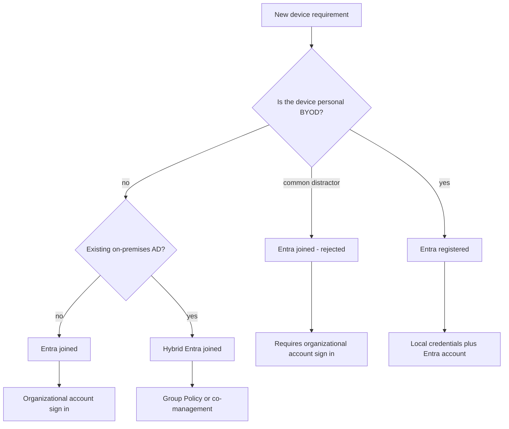
```mermaid
flowchart TD
    A["New device requirement"] --> B{"Is the device personal BYOD?"}
    B -->|"yes"| C["Entra registered"]
    B -->|"no"| D{"Existing on-premises AD?"}
    D -->|"no"| E["Entra joined"]
    D -->|"yes"| F["Hybrid Entra joined"]
    B -->|"common distractor"| G["Entra joined - rejected"]
    G --> H["Requires organizational account sign in"]
    C --> I["Local credentials plus Entra account"]
    E --> J["Organizational account sign in"]
    F --> K["Group Policy or co-management"]
```

### Group type and membership type decision tree
Use this to match a group requirement to the right group type and membership type, especially the dynamic device rule that only security groups support and the P1 license requirement for dynamic membership.

```mermaid
flowchart TD
    A["Group requirement"] --> B{"Main purpose?"}
    B -->|"control access to resources"| C["Security group"]
    B -->|"collaboration mailbox calendar files"| D["Microsoft 365 group"]
    C --> E{"How are members managed?"}


---

# Module 03: Describe guest access and Business to Business accounts - Diagrams

<details><summary>Source lessons</summary>

- Introduction
- Describe guest access and Business to Business accounts
- Manage external collaboration
- Exercise - configure external collaboration
- Invite external users - individually and in bulk
- Exercise - add guest users to directory
- Exercise - invite guest users bulk
- Demo - manage guest users in Microsoft Entra ID
- Manage external user accounts in Microsoft Entra ID
- Manage external users in Microsoft 365 workloads
- Exercise - explore dynamic groups
- Implement and manage Microsoft Entra Verified ID
- Configure identity providers
- Implement cross-tenant access controls
- Summary and resources

</details>

### Diagram 1: Guest sign-in method decision - invitation redemption flow
Useful for exam questions asking which identity provider or authentication method a guest user will use.
```mermaid
flowchart TD
A["Guest user redeems invitation"] --> B{"User exists in managed Entra tenant?"}
B -->|"yes"| C["Sign in with Entra account"]
B -->|"no"| D{"SAML or WS-Fed IdP federation enabled for domain?"}
D -->|"yes"| E["Redirect to partner SAML WS-Fed IdP"]
D -->|"no"| F{"Domain is gmail.com or googlemail.com?"}
F -->|"yes"| G["Redirect to Google"]
F -->|"no"| H{"Existing personal MSA?"}
H -->|"yes"| I["Sign in with MSA"]
H -->|"no"| J{"Email one-time passcode enabled?"}
J -->|"yes"| K["Enter passcode from invited email"]
J -->|"no"| L["Create consumer MSA with invited email"]
```

### Diagram 2: Choosing the correct external identity feature
Exam-style decision tree mapping a requirement to the correct feature, with B2B collaboration as the common distractor for direct connect scenarios.
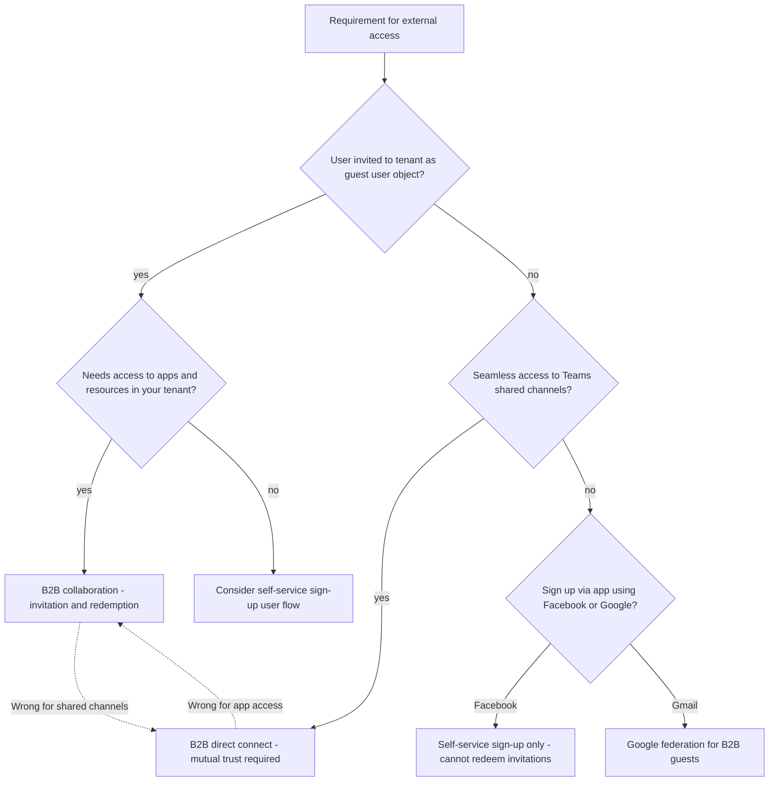
```mermaid
flowchart TD
A["Requirement for external access"] --> B{"User invited to tenant as guest user object?"}
B -->|"yes"| C{"Needs access to apps and resources in your tenant?"}
C -->|"yes"| D["B2B collaboration - invitation and redemption"]
C -->|"no"| E["Consider self-service sign-up user flow"]
B -->|"no"| F{"Seamless access to Teams shared channels?"}
F -->|"yes"| G["B2B direct connect - mutual trust required"]
F -->|"no"| H{"Sign up via app using Facebook or Google?"}
H -->|"Facebook"| I["Self-service sign-up only - cannot redeem invitations"]
H -->|"Gmail"| J["Google federation for B2B guests"]
D -.->|"Wrong for shared channels"| G
G -.->|"Wrong for app access"| D
```

### Diagram 3: Cross-tenant access settings architecture
Helps distinguish inbound, outbound, trust settings, and B2B direct connect defaults on cross-tenant access questions.
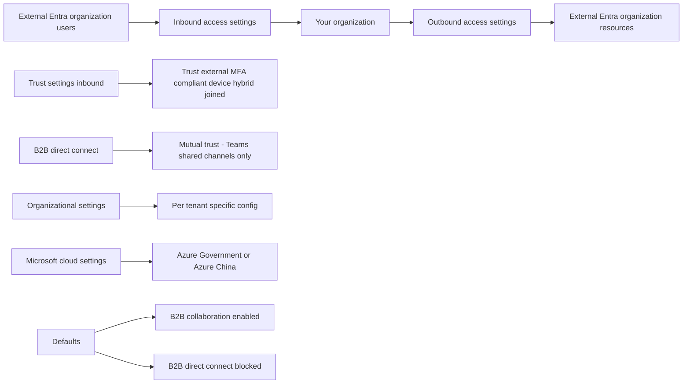
```mermaid
flowchart LR
A["Your organization"] --> B["Outbound access settings"]
B --> C["External Entra organization resources"]
D["External Entra organization users"] --> E["Inbound access settings"]
E --> A
F["Trust settings inbound"] --> G["Trust external MFA compliant device hybrid joined"]
H["B2B direct connect"] --> I["Mutual trust - Teams shared channels only"]
J["Organizational settings"] --> K["Per tenant specific config"]
L["Microsoft cloud settings"] --> M["Azure Government or Azure China"]
N["Defaults"] --> O["B2B collaboration enabled"]
N --> P["B2B direct connect blocked"]
```

### Diagram 4: Bulk invite guest users process
Shows the exact portal path and CSV rules frequently tested for bulk invitation questions.
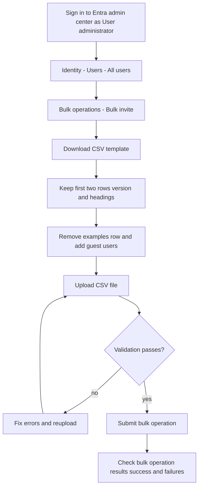
```mermaid
flowchart TD
A["Sign in to Entra admin center as User administrator"] --> B["Identity - Users - All users"]
B --> C["Bulk operations - Bulk invite"]
C --> D["Download CSV template"]
D --> E["Keep first two rows version and headings"]
E --> F["Remove examples row and add guest users"]
F --> G["Upload CSV file"]
G --> H{"Validation passes?"}
H -->|"no"| I["Fix errors and reupload"]
I --> G
H -->|"yes"| J["Submit bulk operation"]
J --> K["Check bulk operation results success and failures"]
```

### Diagram 5: Guest invitation permission decision
Decision tree for selecting the correct external collaboration setting or role when restricting who can invite guests.
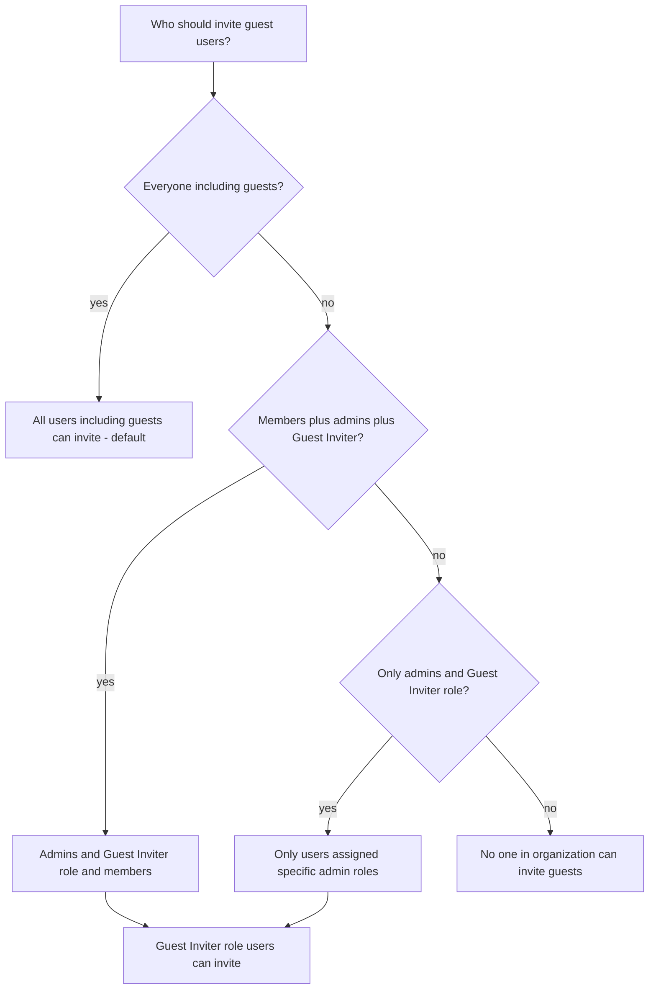
```mermaid
flowchart TD
A["Who should invite guest users?"] --> B{"Everyone including guests?"}
B -->|"yes"| C["All users including guests can invite - default"]
B -->|"no"| D{"Members plus admins plus Guest Inviter?"}
D -->|"yes"| E["Admins and Guest Inviter role and members"]
D -->|"no"| F{"Only admins and Guest Inviter role?"}
F -->|"yes"| G["Only users assigned specific admin roles"]
F -->|"no"| H["No one in organization can invite guests"]
G --> I["Guest Inviter role users can invite"]
E --> I
```

---

# Module 04: Plan, design, and implement Microsoft Entra Connect - Diagrams

Source lessons

- Introduction
- Plan, design, and implement Microsoft Entra Connect
- Implement manage password hash synchronization (PHS)
- Implement manage pass-through authentication (PTA)
- Explore pass-through authentication and seamless single sign-on (SSO)
- Implement and manage federation
- Trouble-shoot synchronization errors
- Implement Microsoft Entra Connect Health
- Manage Microsoft Entra Health
- Summary and resources

### Authentication method decision path
Use this to quickly answer SC-300 questions that give a requirement and ask which sign-in method to choose, including the common distractors.
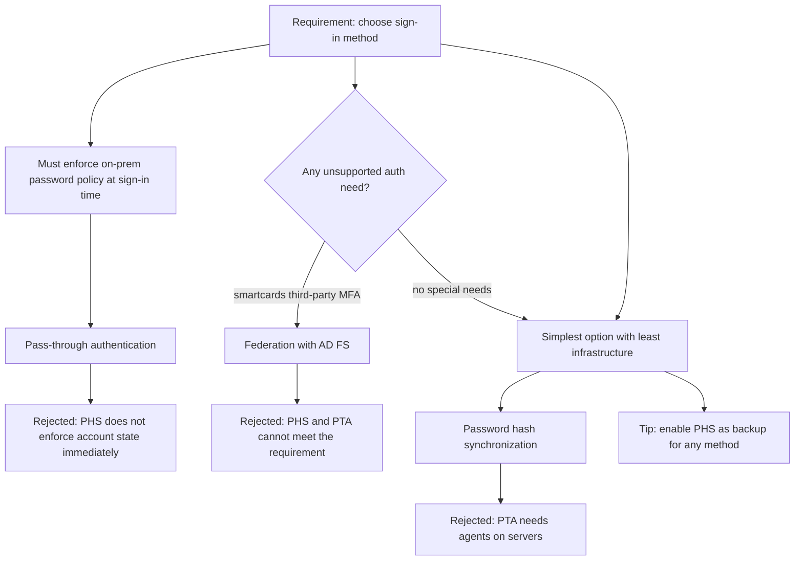
```mermaid
flowchart TD
A["Requirement: choose sign-in method"] --> B["Must enforce on-prem password policy at sign-in time"]
A --> C{"Any unsupported auth need?"}
A --> D["Simplest option with least infrastructure"]
B --> E["Pass-through authentication"]
C -->|"smartcards third-party MFA"| F["Federation with AD FS"]
C -->|"no special needs"| D
D --> G["Password hash synchronization"]
E --> H["Rejected: PHS does not enforce account state immediately"]
F --> I["Rejected: PHS and PTA cannot meet the requirement"]
G --> J["Rejected: PTA needs agents on servers"]
D --> K["Tip: enable PHS as backup for any method"]
```

### Password hash synchronization flow
Use this to recall how the hash of the hash travels and that the sync runs every two minutes.
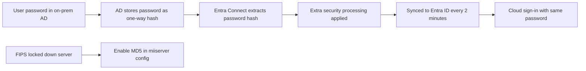
```mermaid
flowchart LR
A["User password in on-prem AD"] --> B["AD stores password as one-way hash"]
B --> C["Entra Connect extracts password hash"]
C --> D["Extra security processing applied"]
D --> E["Synced to Entra ID every 2 minutes"]
E --> F["Cloud sign-in with same password"]
G["FIPS locked down server"] --> H["Enable MD5 in miiserver config"]
```

### Seamless SSO browser sign-in sequence
Use this to answer questions about the Kerberos flow and the AZUREADSSOACC computer account.
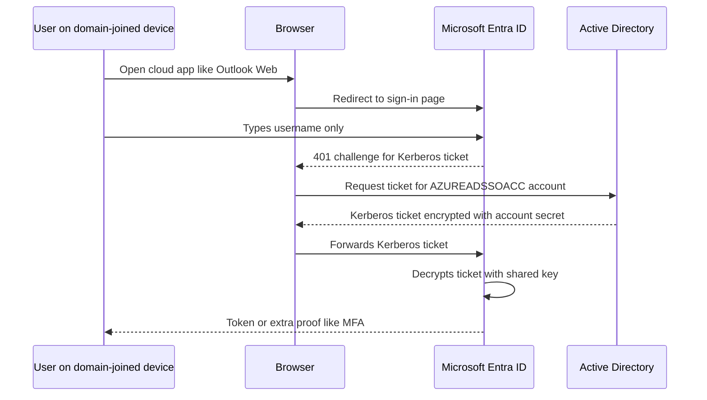
```mermaid
sequenceDiagram
participant U as User on domain-joined device
participant B as Browser
participant E as Microsoft Entra ID
participant A as Active Directory
U->>B: Open cloud app like Outlook Web
B->>E: Redirect to sign-in page
U->>E: Types username only
E-->>B: 401 challenge for Kerberos ticket
B->>A: Request ticket for AZUREADSSOACC account
A-->>B: Kerberos ticket encrypted with account secret
B->>E: Forwards Kerberos ticket
E->>E: Decrypts ticket with shared key
E-->>U: Token or extra proof like MFA
```

### Sync error troubleshooting decision tree
Use this to map a described error scenario to the correct error name and fix, while avoiding the distractor errors.
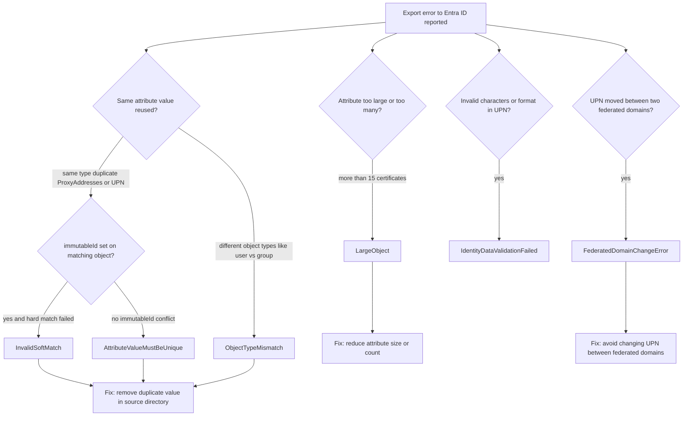
```mermaid
flowchart TD
A["Export error to Entra ID reported"] --> B{"Same attribute value reused?"}
B -->|"different object types like user vs group"| C["ObjectTypeMismatch"]
B -->|"same type duplicate ProxyAddresses or UPN"| D{"immutableId set on matching object?"}
D -->|"yes and hard match failed"| E["InvalidSoftMatch"]
D -->|"no immutableId conflict"| F["AttributeValueMustBeUnique"]
A --> G{"Attribute too large or too many?"}
G -->|"more than 15 certificates"| H["LargeObject"]
A --> I{"UPN moved between two federated domains?"}
I -->|"yes"| J["FederatedDomainChangeError"]
A --> K{"Invalid characters or format in UPN?"}
K -->|"yes"| L["IdentityDataValidationFailed"]
E --> M["Fix: remove duplicate value in source directory"]
F --> M
C --> M
H --> N["Fix: reduce attribute size or count"]
J --> O["Fix: avoid changing UPN between federated domains"]
```

### Entra Connect sync architecture and topologies
Use this to remember the staging areas, the single metaverse, and which topologies are supported versus the distractor options.
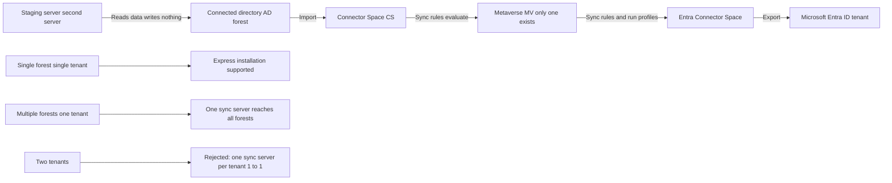
```mermaid
flowchart LR
A["Connected directory AD forest"] -->|"Import"| B["Connector Space CS"]
B -->|"Sync rules evaluate"| C["Metaverse MV only one exists"]
C -->|"Sync rules and run profiles"| D["Entra Connector Space"]
D -->|"Export"| E["Microsoft Entra ID tenant"]
F["Staging server second server"] -->|"Reads data writes nothing"| A
G["Single forest single tenant"] --> H["Express installation supported"]
I["Multiple forests one tenant"] --> J["One sync server reaches all forests"]
K["Two tenants"] --> L["Rejected: one sync server per tenant 1 to 1"]
```

### Connect Health access and diagnose decision path
Use this for questions about required licenses, RBAC roles, and the duplicated attribute self-service fix workflow.
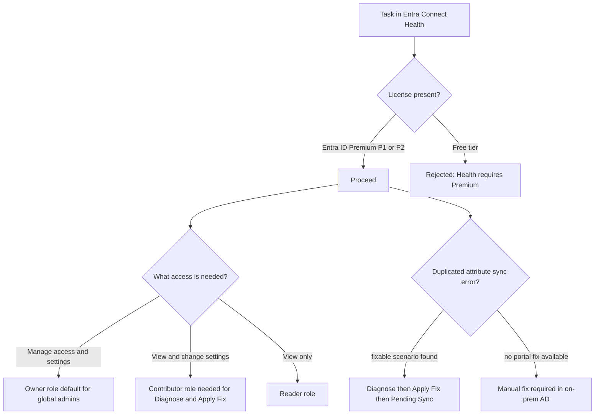
```mermaid
flowchart TD
A["Task in Entra Connect Health"] --> B{"License present?"}
B -->|"Entra ID Premium P1 or P2"| C["Proceed"]
B -->|"Free tier"| D["Rejected: Health requires Premium"]
C --> E{"What access is needed?"}
E -->|"Manage access and settings"| F["Owner role default for global admins"]
E -->|"View and change settings"| G["Contributor role needed for Diagnose and Apply Fix"]
E -->|"View only"| H["Reader role"]
C --> I{"Duplicated attribute sync error?"}
I -->|"fixable scenario found"| J["Diagnose then Apply Fix then Pending Sync"]
I -->|"no portal fix available"| K["Manual fix required in on-prem AD"]
```

---

# Module 04: Plan, design, and implement Microsoft Entra Connect - Diagrams (part 1)

Source lessons

- Introduction
- Plan, design, and implement Microsoft Entra Connect
- Implement manage password hash synchronization (PHS)
- Implement manage pass-through authentication (PTA)
- Explore pass-through authentication and seamless single sign-on (SSO)
- Implement and manage federation
- Trouble-shoot synchronization errors
- Implement Microsoft Entra Connect Health

### Choose the hybrid authentication method
Use this when an exam question describes authentication requirements and you must pick between PHS, PTA and federation while avoiding the classic distractors.

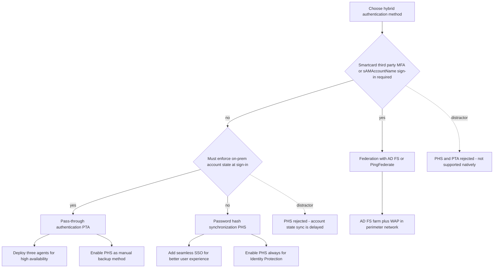
```mermaid
flowchart TD
A["Choose hybrid authentication method"] --> B{"Smartcard third party MFA or sAMAccountName sign-in required"}
B -->|"yes"| G["Federation with AD FS or PingFederate"]
B -->|"no"| C{"Must enforce on-prem account state at sign-in"}
C -->|"yes"| F["Pass-through authentication PTA"]
C -->|"no"| E["Password hash synchronization PHS"]
B -.->|"distractor"| X1["PHS and PTA rejected - not supported natively"]
C -.->|"distractor"| X2["PHS rejected - account state sync is delayed"]
F --> F2["Deploy three agents for high availability"]
F --> F3["Enable PHS as manual backup method"]
G --> G2["AD FS farm plus WAP in perimeter network"]
E --> E2["Add seamless SSO for better user experience"]
E --> E3["Enable PHS always for Identity Protection"]
```

### Troubleshoot synchronization errors by symptom
Use this to map the symptom described in a troubleshooting question to the exact sync error name the exam expects.

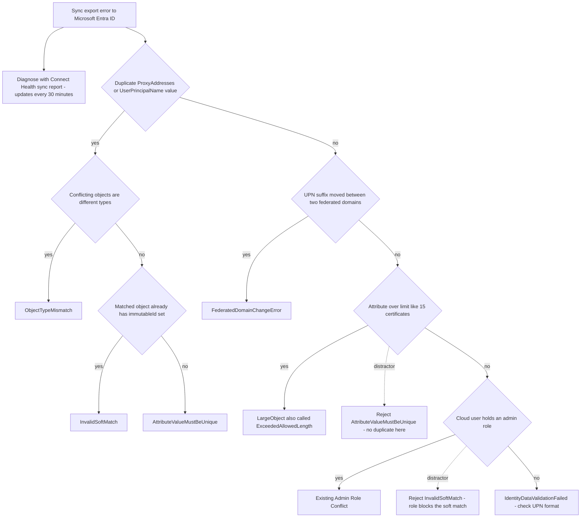
```mermaid
flowchart TD
A["Sync export error to Microsoft Entra ID"] --> R["Diagnose with Connect Health sync report - updates every 30 minutes"]
A --> B{"Duplicate ProxyAddresses or UserPrincipalName value"}
B -->|"yes"| C{"Conflicting objects are different types"}
C -->|"yes"| C1["ObjectTypeMismatch"]
C -->|"no"| D{"Matched object already has immutableId set"}
D -->|"yes"| D1["InvalidSoftMatch"]
D -->|"no"| D2["AttributeValueMustBeUnique"]
B -->|"no"| E{"UPN suffix moved between two federated domains"}
E -->|"yes"| E1["FederatedDomainChangeError"]
E -->|"no"| F{"Attribute over limit like 15 certificates"}
F -->|"yes"| F1["LargeObject also called ExceededAllowedLength"]
F -.->|"distractor"| X1["Reject AttributeValueMustBeUnique - no duplicate here"]
F -->|"no"| G{"Cloud user holds an admin role"}
G -->|"yes"| G1["Existing Admin Role Conflict"]
G -.->|"distractor"| X2["Reject InvalidSoftMatch - role blocks the soft match"]
G -->|"no"| H["IdentityDataValidationFailed - check UPN format"]
```

### Select the sync topology or tool
Use this for questions asking which installation type, topology or sync tool fits a described on-premises environment.

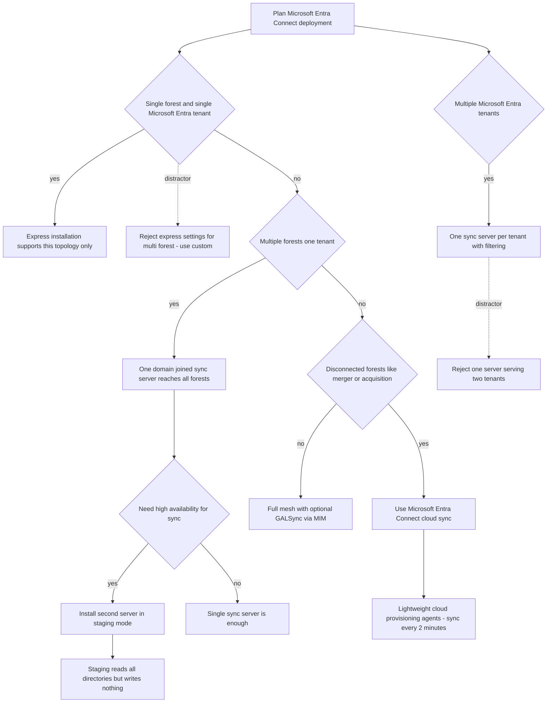
```mermaid
flowchart TD
A["Plan Microsoft Entra Connect deployment"] --> B{"Single forest and single Microsoft Entra tenant"}
B -->|"yes"| C["Express installation supports this topology only"]
B -.->|"distractor"| X1["Reject express settings for multi forest - use custom"]
B -->|"no"| D{"Multiple forests one tenant"}
D -->|"yes"| E["One domain joined sync server reaches all forests"]
D -->|"no"| F{"Disconnected forests like merger or acquisition"}
F -->|"yes"| G["Use Microsoft Entra Connect cloud sync"]
F -->|"no"| H["Full mesh with optional GALSync via MIM"]
E --> I{"Need high availability for sync"}
I -->|"yes"| J["Install second server in staging mode"]
I -->|"no"| K["Single sync server is enough"]
J --> J2["Staging reads all directories but writes nothing"]
G --> G2["Lightweight cloud provisioning agents - sync every 2 minutes"]
A --> N{"Multiple Microsoft Entra tenants"}
N -->|"yes"| O["One sync server per tenant with filtering"]
O -.->|"distractor"| X2["Reject one server serving two tenants"]
```

### Seamless SSO browser sign-in flow
Use this to remember the Kerberos flow and the AZUREADSSOACC computer account, a frequent exam detail.

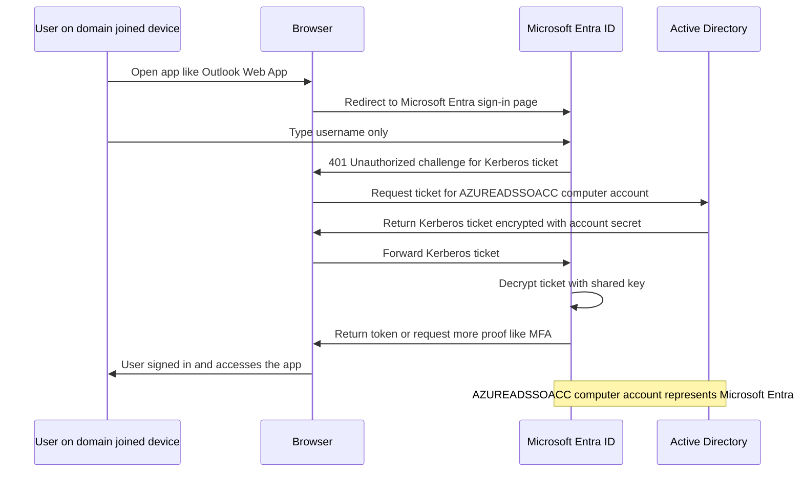
```mermaid
sequenceDiagram
    participant U as User on domain joined device
    participant B as Browser
    participant E as Microsoft Entra ID
    participant A as Active Directory
    U->>B: Open app like Outlook Web App
    B->>E: Redirect to Microsoft Entra sign-in page
    U->>E: Type username only
    E->>B: 401 Unauthorized challenge for Kerberos ticket
    B->>A: Request ticket for AZUREADSSOACC computer account
    A->>B: Return Kerberos ticket encrypted with account secret
    B->>E: Forward Kerberos ticket
    E->>E: Decrypt ticket with shared key
    E->>B: Return token or request more proof like MFA
    B->>U: User signed in and accesses the app
    Note over A,E: AZUREADSSOACC computer account represents Microsoft Entra ID
```

### Where password validation happens per method
Use this to compare the three sign-in methods and recall where validation occurs and which components are required on-premises.

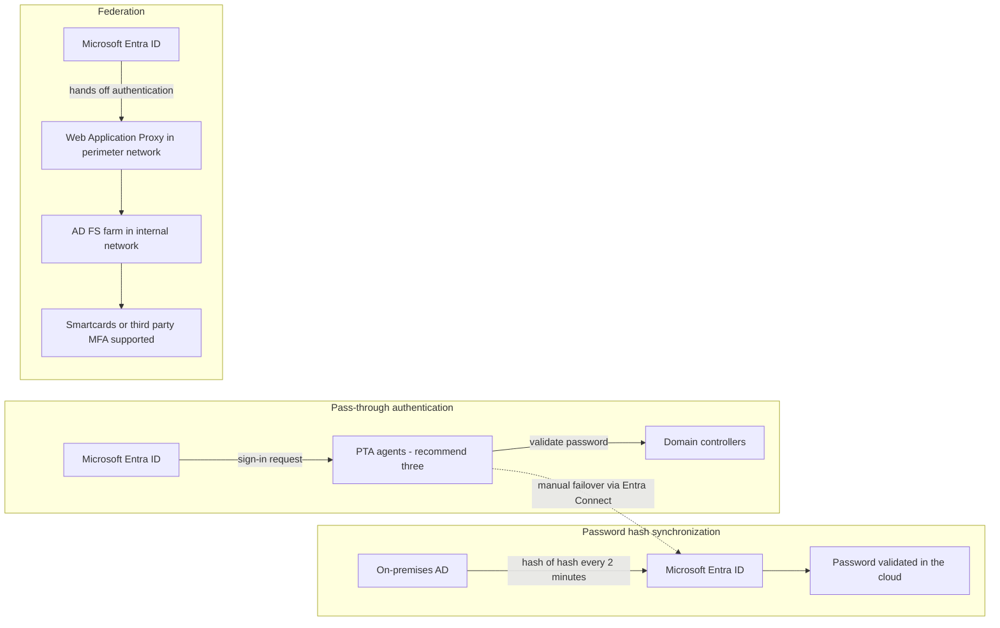
```mermaid
flowchart LR
subgraph PHS["Password hash synchronization"]
A1["On-premises AD"] -->|"hash of hash every 2 minutes"| A2["Microsoft Entra ID"]
A2 --> A3["Password validated in the cloud"]
end
subgraph PTA["Pass-through authentication"]
B3["Microsoft Entra ID"] -->|"sign-in request"| B1["PTA agents - recommend three"]
B1 -->|"validate password"| B2["Domain controllers"]
B1 -.->|"manual failover via Entra Connect"| A2
end
subgraph FED["Federation"]
C1["Microsoft Entra ID"] -->|"hands off authentication"| C2["Web Application Proxy in perimeter network"]
C2 --> C3["AD FS farm in internal network"]
C3 --> C4["Smartcards or third party MFA supported"]
end
```

---

# Module 04: Plan, design, and implement Microsoft Entra Connect - Diagrams (part 2)

Source lessons

- Manage Microsoft Entra Health
- Summary and resources

### RBAC role selection for Microsoft Entra Connect Health
Useful when a question asks which built-in role grants a specific level of access, including the trap that other Azure roles have no impact.

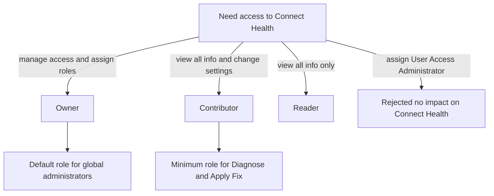
```mermaid
flowchart TD
    A["Need access to Connect Health"] -->|"manage access and assign roles"| B["Owner"]
    A -->|"view all info and change settings"| C["Contributor"]
    A -->|"view all info only"| D["Reader"]
    A -->|"assign User Access Administrator"| E["Rejected no impact on Connect Health"]
    B --> F["Default role for global administrators"]
    C --> G["Minimum role for Diagnose and Apply Fix"]
```

### Duplicated attribute sync error fixability decision
Helps you decide whether a duplicated attribute sync error can be fixed from the portal or requires manual on-premises remediation, a common scenario question.

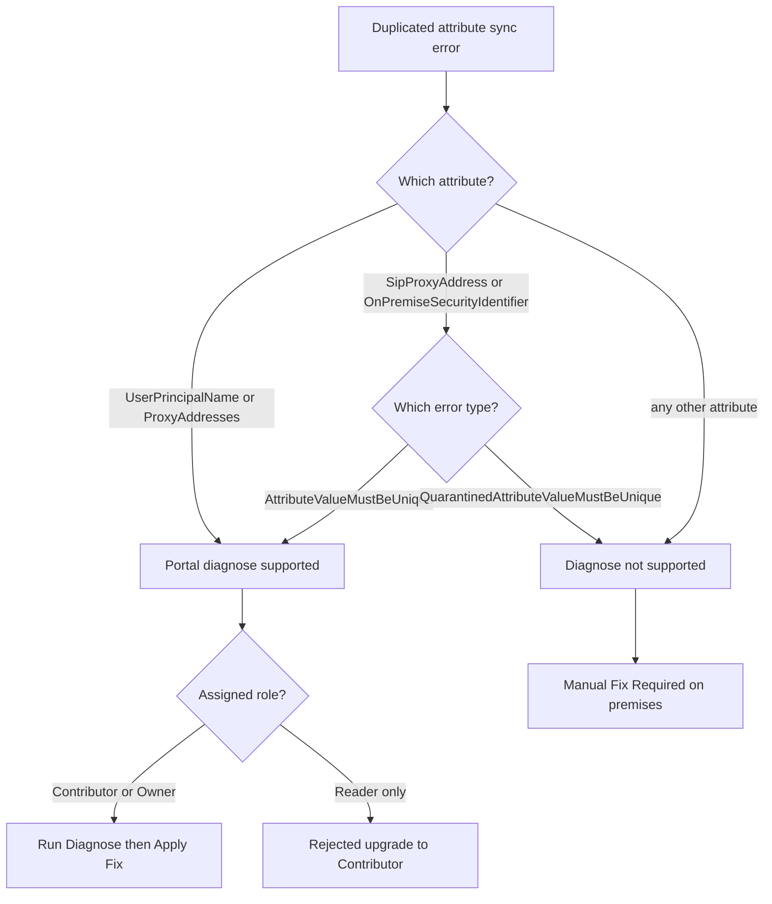
```mermaid
flowchart TD
    A["Duplicated attribute sync error"] --> B{"Which attribute?"}
    B -->|"UserPrincipalName or ProxyAddresses"| C["Portal diagnose supported"]
    B -->|"SipProxyAddress or OnPremiseSecurityIdentifier"| D{"Which error type?"}
    D -->|"AttributeValueMustBeUnique"| C
    D -->|"QuarantinedAttributeValueMustBeUnique"| E["Diagnose not supported"]
    B -->|"any other attribute"| E
    C --> F{"Assigned role?"}
    F -->|"Contributor or Owner"| G["Run Diagnose then Apply Fix"]
    F -->|"Reader only"| H["Rejected upgrade to Contributor"]
    E --> I["Manual Fix Required on premises"]
```

### Delete server versus delete service instance
Useful for comparing the effects of deleting a server versus a service instance, including the premium license requirement and Health Agent behavior.

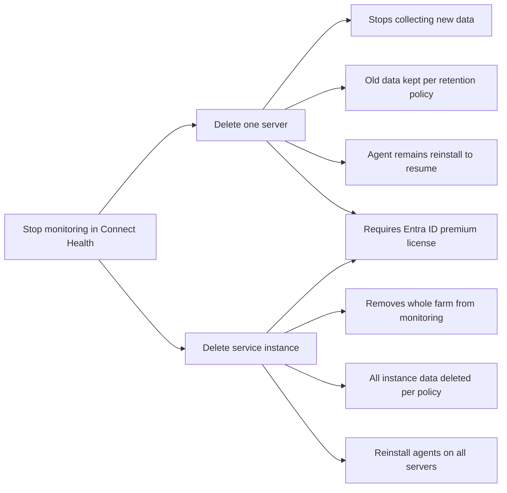
```mermaid
flowchart LR
    A["Stop monitoring in Connect Health"] --> B["Delete one server"]
    A --> C["Delete service instance"]
    B --> D["Stops collecting new data"]
    B --> E["Old data kept per retention policy"]
    B --> F["Agent remains reinstall to resume"]
    C --> G["Removes whole farm from monitoring"]
    C --> H["All instance data deleted per policy"]
    C --> I["Reinstall agents on all servers"]
    B --> J["Requires Entra ID premium license"]
    C --> J
```

### Sync error remediation workflow and statuses
Maps the diagnose status lifecycle so you can predict which status appears after each action in remediation questions.

```mermaid
flowchart TD
    A["Sync error appears in Connect Health"] --> B["Status Not Started"]
    B --> C["Select Diagnose and answer questions"]
    C --> D{"Orphaned object case found?"}
    D -->|"yes"| E["Select Apply Fix"]
    E --> F["Status Pending Sync"]
    F --> G["Next sync cycle clears the error"]
    D -->|"no Close button shown"| H["Status Manual Fix Required"]
    H --> I["Resolve from on-premises side"]
```

### Email notification configuration steps
Summarizes the exact portal steps and default behavior of email notifications, which is testable as an ordering or true or false item.

```mermaid
sequenceDiagram
    participant Admin
    participant P as Connect Health
    Admin->>P: Open Alerts dialog
    Admin->>P: Select Notification Settings
    Admin->>P: Set email notification switch ON
    Admin->>P: Optionally notify all global administrators
    Admin->>P: Add additional email recipients
    Admin->>P: Select Save
    Note over P: Notifications enabled by default
    Note over P: Sync error emails sent as daily digest
```

---

# Module 05: What is Microsoft Entra multifactor authentication - Diagrams

Source lessons

- Introduction
- What is Microsoft Entra multifactor authentication
- Plan your multifactor authentication deployment
- Exercise - Enable Microsoft Entra multifactor authentication
- Configure multifactor authentication methods
- Summary

### Choosing the identity protection feature for a stated requirement
Use this when the exam gives a threat scenario and you must pick between MFA and its look-alike features like Smart Lockout, password protection, SSPR and ID Protection.

```mermaid
flowchart TD
    A["Identity protection requirement"] --> B{"Attacker already has valid password"}
    B -->|"yes"| C{"Require second factor at sign-in"}
    C -->|"yes"| D["Microsoft Entra multifactor authentication"]
    C -->|"no"| E["Rejected smart lockout only stops guessing"]
    B -->|"no"| F{"Brute force sign-in attempts"}
    F -->|"yes"| G["Microsoft Entra smart lockout"]
    F -->|"no"| H{"Block commonly breached passwords"}
    H -->|"yes"| I["Microsoft Entra password protection"]
    H -->|"no"| J{"Auto respond to risky behavior"}
    J -->|"yes"| K["Microsoft Entra ID Protection"]
    J -->|"no"| L["SSPR or password rules"]
```

### Selecting the MFA authentication method
Use this to match method requirements to features, including the FIDO2 versus Windows Hello distractor and the free-tier voice call limitation.

```mermaid
flowchart TD
    A["Select MFA authentication method"] --> B{"Unphishable passwordless hardware key"}
    B -->|"yes"| C["FIDO2 security key USB Bluetooth NFC"]
    B -->|"no"| D{"Biometric or PIN tied to device"}
    D -->|"yes"| E["Windows Hello for Business"]
    D -->|"no"| F{"Must work with limited connectivity"}
    F -->|"yes"| G["Mobile app verification code 30 second OATH"]
    F -->|"no"| H{"Android device in China"}
    H -->|"yes"| I["Rejected verification code unsupported there"]
    H -->|"no"| J{"Non-browser app lacks MFA support"}
    J -->|"yes"| K["App password"]
    J -->|"no"| L{"Free or trial tenant"}
    L -->|"yes"| M["Rejected voice call unavailable"]
    L -->|"no"| N["Voice call preferred for backup"]
```

### Deciding how users register for MFA
Use this when the exam asks for the easiest or the most automated registration approach and which license each option requires.

```mermaid
flowchart TD
    A["Plan user registration for MFA"] --> B{"Identity Protection license owned"}
    B -->|"yes"| C["Easiest option prompt at next sign-in"]
    B -->|"no"| D{"Enforce registration for everyone"}
    D -->|"yes"| E["Conditional Access on all users group"]
    E --> F["Periodically remove registered users manually"]
    D -->|"no"| G["Prompt when app requires MFA"]
    B --> H["Rejected security defaults are all or nothing"]
```

### Portal path to configure MFA settings and a Conditional Access policy
Use this to memorize the exact blade navigation and the required role for the enable MFA exercise.

```mermaid
flowchart LR
    A["Sign in as Authentication Administrator"] --> B["Microsoft Entra ID blade"]
    B --> C["Security"]
    C --> D["Multifactor authentication"]
    D --> E["Additional cloud-based MFA settings"]
    E --> F["Service settings and app passwords"]
    C --> G["Conditional Access"]
    G --> H["Create new policy"]
    H --> I["Assign users and groups"]
    I --> J["Target resources cloud apps"]
    J --> K["Grant access require MFA"]
    K --> L["Enable policy On then Create"]
```

### First sign-in registration versus later MFA sign-ins
Use this to recall the user experience flow tested in scenario questions about first-time registration prompts and repeat prompts.

```mermaid
sequenceDiagram
    participant U as User
    participant E as Microsoft Entra ID
    participant A as App requiring MFA
    U->>A: First sign-in
    A->>E: MFA required
    E->>U: Prompt to register preferred method
    U->>E: Registers authentication method
    E->>A: Access granted
    U->>A: Later sign-in
    A->>E: MFA required
    E->>U: Prompt for registered factor
    U->>E: Approves notification or enters code
    E->>A: Access granted
```

---

# Module 06: Administer FIDO2 and passwordless authentication methods - Diagrams

Source lessons

- Introduction
- Administer FIDO2 and passwordless authentication methods
- Explore Authenticator app and OATH tokens
- Implement an authentication solution based on Windows Hello for Business
- Exercise configure and deploy self-service password reset
- Deploy and manage password protection
- Configure smart lockout thresholds
- Exercise - Manage Microsoft Entra smart lockout values
- Implement Kerberos and certificate-based authentication in Microsoft Entra ID
- Configure Microsoft Entra user authentication for virtual machines
- Summary and resources

### Decision tree: Choosing the right authentication method
Use this to map exam requirements like unphishable or passwordless to the correct method while spotting the classic SMS and password-only distractors.

```mermaid
flowchart TD
    A["Select authentication method for scenario"] --> B{"Unphishable hardware passwordless sign in?"}
    B -->|"yes"| C["FIDO2 security key"]
    B -->|"no"| D{"Passwordless phone sign in with push?"}
    D -->|"yes"| E["Microsoft Authenticator app"]
    D -->|"no"| F{"Windows sign in with PIN or biometric?"}
    F -->|"yes"| G["Windows Hello for Business"]
    F -->|"no"| H{"Only for SSPR verification?"}
    H -->|"yes"| I["Security questions or email"]
    H -->|"no"| J{"Legacy app without modern auth?"}
    J -->|"yes"| K["App passwords with per user MFA"]
    J -->|"no"| L{"SMS as strong factor?"}
    L -->|"yes"| M["Rejected SMS is medium security"]
    L -->|"no"| N["Password alone rejected low security"]
```

### Decision tree: SSPR licensing requirements
Use this to recall the exact license tiers that unlock SSPR for cloud-only versus on-premises accounts, a frequent licensing trap on the exam.

```mermaid
flowchart TD
    A["Enable self service password reset"] --> B{"Where are user accounts?"}
    B -->|"cloud only"| C{"Which license?"}
    B -->|"synced from on premises AD"| D{"Which license?"}
    C -->|"Entra P1 or P2"| E["SSPR supported"]
    C -->|"Microsoft 365 Business Standard"| E
    C -->|"Free"| F["Rejected upgrade license needed"]
    D -->|"Entra P1 or P2"| E
    D -->|"Microsoft 365 Business Premium"| E
    D -->|"Business Standard only"| F
```

### Sequence diagram: Kerberos Constrained Delegation via Application Proxy
Use this to memorize the exact order of the KCD flow, which is tested in Application Proxy single sign-on questions.

```mermaid
sequenceDiagram
    participant U as User
    participant P as Application Proxy
    participant E as Microsoft Entra ID
    participant C as Connector
    participant A as Active Directory
    participant S as App server
    U->>P: Request application URL
    P->>E: Redirect for preauthentication
    E->>U: Token issued after MFA policies
    U->>P: Present token
    P->>C: UPN and SPN over secure channel
    C->>A: KCD negotiation impersonating user
    A->>C: Kerberos token for application
    C->>S: Original request with Kerberos token
    S->>C: Application response
    C->>P: Response
    P->>U: Response delivered
```

### Architecture: Microsoft Entra Password Protection on-premises components
Use this to remember that the proxy service is the only outbound internet path, that policies cache in sysvol, and how audit versus enforce mode behaves.

```mermaid
flowchart LR
    A["Writable DC with DC agent"] -->|"requests password policy"| B["Proxy service on member server"]
    B -->|"only outbound internet path"| C["Microsoft Entra ID"]
    C -->|"global and custom banned lists"| B
    B -->|"policy response"| A
    A -->|"stores policy in sysvol"| D["Cached policy refreshed hourly"]
    D -->|"password change or set event"| E{"Deployment mode"}
    E -->|"audit"| F["Logged only not blocked"]
    E -->|"enforce"| G["Weak password blocked"]
    H["RODC"] -->|"forwards changes no agent"| A
```

### Decision tree: Smart lockout configuration for hybrid deployments
Use this to recall the threshold and duration rules for pass-through authentication scenarios and the P1 licensing requirement for customization.

```mermaid
flowchart TD
    A["Smart lockout configuration needed"] --> B{"Premium P1 or higher licensed?"}
    B -->|"no"| C["Defaults only 10 attempts 1 minute lock"]
    B -->|"yes"| D{"Pass through authentication hybrid?"}
    D -->|"no"| E["Customize in Password protection settings"]
    D -->|"yes"| F["Set Entra threshold below AD DS threshold"]
    F --> G{"AD DS threshold 2 to 3 times larger?"}
    G -->|"yes"| H["Correct attacks filtered before AD DS"]
    G -->|"no"| I["Rejected risk of locking on premises users"]
    F --> J{"Entra duration longer than AD DS?"}
    J -->|"yes"| K["Correct seconds versus minutes"]
    J -->|"no"| L["Rejected align durations properly"]
```

---

# Module 07: Plan security defaults - Diagrams

Source lessons

- Introduction
- Plan security defaults
- Exercise - Work with security defaults
- Plan Conditional Access policies
- Implement Conditional Access policy controls and assignments
- Exercise - Implement Conditional Access policies roles and assignments
- Test and troubleshoot Conditional Access policies
- Implement application controls
- Implement session management and continuous access evaluation
- Exercise - Configure authentication session controls
- Microsoft Entra Conditional Access Optimization agent
- Summary and resources

### Decision tree - Security defaults or Conditional Access
Use this to answer exam questions asking which baseline protection fits a given organization and license tier.

```mermaid
flowchart TD
    A["Organization needs baseline identity security"] --> B{"Microsoft Entra ID license tier"}
    B -->|"Free tier"| C["Enable security defaults"]
    B -->|"Premium P1 or P2"| D["Security defaults rejected use CA instead"]
    B -->|"Free but wants granular control"| E["Conditional Access rejected requires P1"]
    C --> F["MFA registration for all users"]
    C --> G["MFA every sign-in for admins"]
    C --> H["Block legacy authentication protocols"]
    C --> I["Protect Azure portal access"]
    C --> J["Enabled by default on new tenants"]
```

### Decision tree - License tier and Conditional Access capability
Use this to match a required capability such as risk-based policies to the correct license and reject the common wrong-tier distractor.

```mermaid
flowchart TD
    A["Conditional Access requirement"] --> B{"License tier"}
    B -->|"Free or Office 365"| C["No Conditional Access available"]
    B -->|"P1 or Microsoft 365 E3"| D["Standard Conditional Access policies"]
    B -->|"P2"| E["Standard CA plus risk-based policies"]
    A -->|"needs sign-in risk policy"| F["Risk policy on P1 rejected needs P2"]
    D --> G["MFA compliant device location controls"]
    E --> H["Sign-in risk and user risk policies"]
```

### Process - Create and roll out a Conditional Access policy
Use this to recall the exact portal path, required exclusions, and the report-only phased rollout order tested on the exam.

```mermaid
flowchart TD
    A["Sign in as Conditional Access Administrator"] --> B["Protection then Conditional Access then New policy"]
    B --> C["Assign users and groups"]
    C --> D["Exclude emergency access accounts"]
    D --> E["Target resources and set conditions"]
    E --> F["Set Grant or Session controls"]
    F --> G["Enable Report-only"]
    G --> H["Monitor sign-in logs"]
    H --> I{"Behavior as expected"}
    I -->|"No"| J["Adjust policy"]
    J --> G
    I -->|"Yes"| K["Enable On for pilot users"]
    K --> L["Expand while excluding administrators"]
    L --> M["Apply to all users after testing"]
```

### Sequence - Continuous Access Evaluation revocation flow
Use this to explain how CAE near-real-time revocation works instead of waiting for token expiry.

```mermaid
sequenceDiagram
    participant C as CAE capable client
    participant E as Microsoft Entra ID
    participant R as Resource provider
    participant A as Administrator
    C->>E: Present credentials or refresh token
    E->>C: Access token issued
    A->>E: Revoke all refresh tokens
    E->>R: Revocation event sent
    C->>R: Present access token
    R->>C: Deny access with 401 claim challenge
    C->>E: Refresh token plus claim challenge
    E->>C: Reevaluate conditions and prompt reauthentication
```

### Decision tree - Troubleshoot a Conditional Access sign-in block
Use this to order the troubleshooting tools and log tabs correctly when a scenario describes a blocked sign-in.

```mermaid
flowchart TD
    A["Sign-in blocked or policy misbehaving"] --> B["Simulate with What If tool"]
    B --> C["Read error page and More Details"]
    C --> D["Open Entra sign-in logs"]
    D --> E{"Sign-in event found"}
    E -->|"No"| F["Filter by Correlation ID user or date"]
    F --> D
    E -->|"Yes"| G["Open Conditional Access tab"]
    G --> H["Review applied policies and policy details"]
    H --> I["Check Troubleshooting and support tab"]
    I --> J{"Cause identified"}
    J -->|"No"| K["Create support request with request ID"]
    J -->|"Yes"| L["Edit policy from Policy Name link"]
```

---

# Module 08: Review identity protection basics - Diagrams

Source lessons

- Introduction
- Review identity protection basics
- Implement and manage user risk policy
- Exercise enable sign-in risk policy
- Exercise configure Microsoft Entra multifactor authentication registration polic
- Monitor, investigate, and remediate elevated risky users
- Implement security for workload identities
- Explore Microsoft Defender for Identity
- Explore the Identity Risk Management Agent
- Summary and resources

### Identity Protection capability and license decision tree
Use this to answer classic SC-300 license-tier questions by matching the required capability to Microsoft Entra ID Premium P2 and eliminating the Free or P1 distractor.
```mermaid
flowchart TD
    A["Exam requirement"] --> B{"Capability needed?"}
    B -->|"Automate risk response"| C["Risk policies"]
    B -->|"Full risk reports and alerts"| D["Security reports and notifications"]
    B -->|"Enforce MFA registration"| E["MFA registration policy"]
    C --> F{"License tier?"}
    D --> F
    E --> F
    F -->|"Premium P2"| G["Correct - feature available"]
    F -->|"Free or P1"| H["Rejected distractor - needs P2"]
    G --> I{"Who configures policies?"}
    I -->|"Security Administrator"| J["Correct - full access"]
    I -->|"Security Operator or Reader"| K["Rejected - cannot configure policies"]
```

### Remediation decision path for a risky user
Use this to pick the correct remediation or unblocking action in scenario questions, with dismiss user risk exposed as the distractor that does not secure the account.
```mermaid
flowchart TD
    A["User flagged at risk"] --> B{"Registered for MFA and SSPR?"}
    B -->|"Yes"| C["Self-remediation with risk policy"]
    B -->|"No"| D{"Can admin reset password?"}
    D -->|"Yes"| E{"User registered for SSPR?"}
    E -->|"Yes"| F["Require user to reset password"]
    E -->|"No"| G["Generate temporary password"]
    D -->|"No - user deleted"| H["Dismiss user risk"]
    G --> I["User sets new password at next sign-in"]
    H --> J["Rejected as full remediation - password unchanged"]
```

### Choosing the correct Identity Protection report
Use this to match an investigation requirement to the risky users, risky sign-ins, or risk detections report and recall the 30 day, 90 day and download limits.
```mermaid
flowchart TD
    A["Investigation requirement"] --> B{"What must you review?"}
    B -->|"User risk level and history"| C["Risky users report"]
    B -->|"Sign-in risk and MFA details"| D["Risky sign-ins report"]
    B -->|"Detection type and location"| E["Risk detections report"]
    B -->|"Sign-in data older than 30 days"| F["Rejected - risky sign-ins limit 30 days"]
    F --> E
    C --> G["Download max 2500 entries"]
    D --> G
    E --> H["Download max 5000 records"]
```

### Configuring the three Identity Protection policies
Use this to recall the exact portal path and the recommended thresholds and access controls for the user risk, sign-in risk, and MFA registration policies.
```mermaid
flowchart TD
    A["Sign in as Global administrator"] --> B["Identity - Protection - Identity Protection"]
    B --> C{"Which policy to configure?"}
    C -->|"User risk policy"| D["User risk threshold High"]
    D --> E["Require password change"]
    C -->|"Sign-in risk policy"| F["Sign-in risk Medium and above"]
    F --> G["Require MFA"]
    C -->|"MFA registration policy"| H["Fixed control - Require MFA registration"]
    E --> I["Exclude emergency access accounts"]
    G --> I
    H --> I
    I --> J["Enforce policy On then Save"]
```

### Defender for Identity architecture and data flow
Use this to match Defender for Identity components to their functions, a common component-to-purpose matching question on the exam.
```mermaid
flowchart LR
    A["Domain controllers"] -->|"Sensor - no port mirroring"| D["Defender for Identity cloud service"]
    B["AD FS servers"] -->|"Sensor"| D
    F["Microsoft threat intelligence"] --> D
    D -->|"Alerts and attack timeline"| E["Microsoft Defender portal"]
    E --> G["SecOp analysts triage and investigate"]
```

---

# Module 09: Assign Azure roles - Diagrams

Source lessons

- Introduction
- Assign Azure roles
- Configure custom Azure roles
- Create and configure managed identities
- Access Azure resources with managed identities
- Analyze Azure role permissions
- Configure Azure Key Vault RBAC policies
- Retrieve objects from Azure Key Vault
- Summary and resources

### Decision tree - Choosing the security principal for a role assignment
Useful when an exam question asks which principal should receive an Azure role for a given scenario, including the hard-coded-credentials distractor.

```mermaid
flowchart TD
    A["Who needs access to the resource"] --> B{"Single person only"}
    B -->|"yes"| C["Assign role to a User"]
    B -->|"no"| D{"Same role for many users"}
    D -->|"yes"| E["Assign role to a Group"]
    D -->|"no"| F{"Application needs resource access"}
    F -->|"yes"| G{"App should manage its own credentials"}
    G -->|"yes"| H["Managed Identity"]
    G -->|"no"| I["Service Principal"]
    F -->|"distractor"| J["Rejected - hard coded app credentials"]
```

### Decision tree - Key Vault RBAC versus access policies
Useful for questions asking which Key Vault access model fits a requirement, including the trap of assigning policies to individual users.

```mermaid
flowchart TD
    A["Grant access to Key Vault objects"] --> B{"Manage permissions across all vaults"}
    B -->|"yes"| C["Use Azure RBAC roles"]
    B -->|"no"| D{"Need granular per object control"}
    D -->|"yes"| E["Use Key Vault access policies"]
    D -->|"no"| C
    C --> F["Separate roles for keys secrets certificates"]
    E --> G["Assign policies to groups not users"]
    A -->|"distractor"| H["Rejected - access policy per individual user"]
```

### Decision tree - System-assigned versus user-assigned managed identity
Useful for distinguishing the two managed identity types by lifecycle and rejecting the service-principal-with-stored-secret distractor.

```mermaid
flowchart TD
    A["App needs Entra tokens with no credentials"] --> B{"Identity tied to one resource lifecycle"}
    B -->|"yes"| C["System assigned managed identity"]
    B -->|"no"| D{"Shared across multiple resources"}
    D -->|"yes"| E["User assigned managed identity"]
    D -->|"no"| C
    C --> C1["Deleted automatically with the resource"]
    E --> E1["Managed separately from the resources"]
    A -->|"distractor"| F["Rejected - service principal with stored secret"]
```

### Process - The five steps to assign an Azure role
Useful for recalling the ordered role assignment steps, the supported tools, and the assignment limits tested on the exam.

```mermaid
flowchart TD
    A["Start - grant access to Azure resource"] --> B["Step 1 - pick the security principal"]
    B --> C["Step 2 - choose built-in or custom role"]
    C --> D["Step 3 - pick the scope level"]
    D --> E["Step 4 - confirm your own assignment rights"]
    E --> F["Step 5 - assign the role"]
    F --> G["Portal - Access control IAM page"]
    F --> H["PowerShell - New-AzRoleAssignment"]
    F --> I["CLI - az role assignment create"]
    F --> J["Limit - 4000 assignments per subscription"]
    F --> K["Limit - 500 assignments per management group"]
```

### Architecture - Azure scope hierarchy and inheritance
Useful for visualizing the four scope levels and how lower levels inherit role permissions, a recurring exam topic.

```mermaid
flowchart LR
    A["Management group"] -->|"role inherits down"| B["Subscription"]
    B -->|"role inherits down"| C["Resource group"]
    C -->|"role inherits down"| D["Resource"]
    E["Each level is more specific"] --> A
    F["Least privilege - narrow scope"] --> D
```

---

# Module 10: Explore Global Secure Access - Diagrams

Source lessons

- Introduction
- Explore Global Secure Access
- Deploy and configure Microsoft Entra Internet Access
- Deploy and configure Microsoft Entra Private Access
- Explore how to use the Dashboard to drive Global Secure Access
- Create remote networks for use with Global Secure Access
- Use Conditional Access with Global Secure Access
- Explore logs and monitoring options with Global Secure Access
- Summary and resources

### Choosing Between Microsoft Entra Internet Access and Private Access
Use this decision tree to pick the correct Global Secure Access component when an exam question describes a resource type or scenario, including the classic VPN distractor.

```mermaid
flowchart TD
    A["What needs secure access?"] -->|"Microsoft SaaS and public internet"| B["Microsoft Entra Internet Access"]
    A -->|"Private corporate resources"| C["Microsoft Entra Private Access"]
    B --> D["Secure Web Gateway protection"]
    B --> E["Universal tenant restrictions"]
    B --> F["Web category filtering"]
    C --> G["Quick Access app segments"]
    C --> H["Per app Conditional Access"]
    A -->|"Connect users with legacy VPN"| X["Rejected - VPN not required"]
    A -->|"Replace existing third party SSE"| Y["Rejected - deploy side by side instead"]
```

### Conditional Access Decision Path with Global Secure Access
Use this to match a Conditional Access requirement to the correct Global Secure Access capability, and to remember the signaling prerequisite.

```mermaid
flowchart TD
    A["Security goal with Global Secure Access"] -->|"Stop stolen token replay"| B["Compliant network check"]
    A -->|"Keep source IP location policies"| C["Source IP restoration"]
    A -->|"Protect Quick Access private apps"| D["Conditional Access on Private Access apps"]
    A -->|"Block unallowed external tenants"| E["Universal tenant restrictions"]
    B --> F["Prerequisite - enable Global Secure Access signaling"]
    C --> F
    F --> G["Named location All Compliant Network locations"]
    E --> H["Configure in cross tenant access settings"]
    A -->|"Maintain list of office IP addresses"| I["Rejected - use compliant network location instead"]
```

### Global Secure Access Traffic Flow Architecture
Use this architecture view to answer questions about how client traffic and branch office traffic reach Microsoft, internet, and private resources.

```mermaid
flowchart LR
    U["Remote user with Global Secure Access client"] --> IA["Microsoft Entra Internet Access"]
    U --> PA["Microsoft Entra Private Access"]
    IA --> SWG["Secure Web Gateway"]
    SWG --> RES["Microsoft 365 SaaS and internet"]
    PA --> CON["Private network connector"]
    CON --> PRIV["Private apps and data centers"]
    IA --> WAN["Microsoft Wide Area Network"]
    PA --> WAN
    CPE["Branch office CPE router"] -->|"IPsec tunnel"| WAN
```

### Deployment Steps for Internet Access and Private Access
Use this side-by-side process map to memorize the four ordered deployment steps of each component and their key configuration details.

```mermaid
flowchart TD
    A["Deploy Global Secure Access"] --> B["Internet Access path"]
    A --> C["Private Access path"]
    B --> B1["Step 1 Enable Microsoft traffic forwarding profile"]
    B1 --> B2["Step 2 Install Global Secure Access client"]
    B2 --> B3["Step 3 Enable tenant restrictions"]
    B3 --> B4["Step 4 Enable signaling and Conditional Access"]
    B4 --> B5["Block policy excludes break glass accounts"]
    C --> C1["Step 1 Install private network connector"]
    C1 --> C2["Step 2 Configure Quick Access app"]
    C2 --> C3["Step 3 Enable Private Access traffic forwarding"]
    C3 --> C4["Step 4 Install Global Secure Access client"]
    C1 --> C5["Windows Server 2016 or later with TLS 1.2"]
    C2 --> C6["FQDN IP CIDR or IP range segments"]
```

### Remote Network Configuration Workflow
Use this sequence to remember that the final remote network step happens on the on-premises router, not in the Microsoft Entra admin center.

```mermaid
sequenceDiagram
    participant Admin as Global Secure Access Administrator
    participant Portal as Microsoft Entra admin center
    participant CPE as On premises router
    Admin->>Portal: Create remote network with name and region
    Admin->>Portal: Enter connectivity details of CPE
    Admin->>Portal: Add traffic forwarding profile
    Portal->>Admin: Review configuration shows Microsoft side settings
    Admin->>CPE: Enter connection details in router console
    CPE->>Portal: IKE negotiation establishes IPsec tunnel
```

---

# Module 11: Discover apps by using Microsoft Defender for Cloud Apps and Active Directory Fe - Diagrams

Source lessons

- Introduction
- Discover apps by using Microsoft Defender for Cloud Apps and Active Directory Fe
- Configure connectors to apps
- Exercise implement access management for apps
- Design and implement app management roles
- Exercise create a custom role to manage app registration
- Configure preintegrated gallery SaaS apps
- Implement and manage policies for OAuth apps
- Summary and resources

### Diagram 1: Choosing the right app discovery tool
Use this to match a discovery requirement to the correct tool and eliminate the classic distractors that swap Cloud Discovery with the AD FS report.
```mermaid
flowchart TD
    A["Exam requirement - discover apps"] --> B{"What must be discovered?"}
    B -->|"Shadow IT cloud apps in use"| C["Cloud Discovery in MDCA"]
    B -->|"AD FS apps to migrate"| D["AD FS application activity report"]
    B -->|"Modern protocols SAML OIDC"| E["Gallery connector or app registration"]
    B -->|"Legacy protocols on-premises app"| F["Application Proxy or Domain Services"]
    C -->|"wrong choice for migration"| X1["Distractor - AD FS report"]
    D -->|"wrong choice for shadow IT"| X2["Distractor - Cloud Discovery"]
```

### Diagram 2: Delegating application management - role selection
Use this to pick the least-privilege role or delegation method in app management scenarios, including the app proxy and Conditional Access gotchas.
```mermaid
flowchart TD
    A["Delegate application management"] --> B{"What must the delegate do?"}
    B -->|"Manage app proxy settings"| C["Application Administrator role"]
    B -->|"Manage apps without proxy"| D["Cloud Application Administrator role"]
    B -->|"Manage one specific app"| E["Application owner"]
    B -->|"Granular permissions at object scope"| F["Custom role"]
    B -->|"Register apps when default disabled"| G["Application Developer role"]
    C -->|"distractor for proxy tasks"| X1["Rejected - Cloud Application Administrator"]
    C -->|"limitation"| H["Neither admin role manages Conditional Access"]
    D --> H
    E -->|"limitation"| I["Only users own enterprise apps"]
```

### Diagram 3: AD FS application activity report workflow and migration statuses
Use this to recall the exact portal path and the three migration statuses tested in AD FS migration questions.
```mermaid
flowchart TD
    A["Sign in with allowed admin role"] --> B["Microsoft Entra ID blade"]
    B --> C["Enterprise applications"]
    C --> D["Usage and insights under Activity"]
    D --> E["AD FS application activity"]
    E --> F["Apps with sign-ins in last 30 days"]
    F --> G{"Migration status?"}
    G -->|"Ready to migrate"| H["Migrate as-is"]
    G -->|"Needs review"| I["Review settings that cannot migrate"]
    G -->|"Additional steps required"| J["Cannot migrate in current state"]
```

### Diagram 4: App connector connection flow in Defender for Cloud Apps
Use this to remember the connector scan order and the 12-hour plus real-time data scan cadence.
```mermaid
sequenceDiagram
    participant Admin
    participant MDCA as Defender for Cloud Apps
    participant App as Connected app API
    Admin->>MDCA: Connect app using provider API
    MDCA->>App: Scan and save authentication permissions
    MDCA->>App: Request user list
    App-->>MDCA: Users returned after first scan
    loop Periodic scans
        MDCA->>App: Scan users groups activities files
    end
    MDCA-->>Admin: Activities visible after first full scan


---

# Module 12: Implement token customizations - Diagrams

<details><summary>Source lessons</summary>

- Introduction
- Implement token customizations
- Implement and configure consent settings
- Integrate on-premises apps with Microsoft Entra application proxy
- Integrate custom SaaS apps for single sign-on
- Implement application-based user provisioning
- Monitor and audit access to Microsoft Entra integrated enterprise applications
- Create and manage application collections
- Summary and resources

</details>

### Choosing remote access for on-premises apps
Use this to answer exam questions asking which solution provides secure remote access to on-premises web apps and to eliminate the VPN and reverse proxy distractors.
```mermaid
flowchart TD
    A["Requirement - remote users need on-premises web apps"] --> B{"Who needs access?"}
    B -->|"remote users"| C{"Choose the access solution"}
    C -->|"correct answer"| D["Microsoft Entra application proxy"]
    C -->|"common distractor"| E["VPN or reverse proxy - rejected"]
    D --> F["Supports IWA, form-based and header-based apps"]
    D --> G["Supports Remote Desktop Gateway and MSAL clients"]
    B -->|"internal users on corporate network"| H["Rejected - not intended for internal users"]
```

### Selecting the correct SSO protocol
Use this when a question describes an app scenario and you must pick between OAuth 2.0, OpenID Connect and SAML without mixing up authentication and authorization.
```mermaid
flowchart TD
    A{"What must the protocol do?"} -->|"authorize access to resources"| B["OAuth 2.0"]
    A -->|"authenticate - purely cloud apps"| C["OpenID Connect"]
    A -->|"authenticate - enterprise ADFS federated apps"| D["SAML"]
    A -->|"distractor - OAuth for sign-in"| E["Rejected - OAuth is authorization only"]
    C --> F["Built on top of OAuth 2.0"]
    C --> G["Used for mobile apps, web sites, web APIs"]
    D --> H["Frequently used in enterprise applications"]
```

### Application Proxy sign-in flow
Use this to reconstruct the exact order of the Application Proxy sign-in sequence, a common process-order question on the exam.
```mermaid
sequenceDiagram
    participant U as User
    participant E as Microsoft Entra ID
    participant S as Application Proxy service
    participant C as Application Proxy connector
    participant A as On-premises app
    U->>E: Access application through endpoint
    E->>U: Direct to Microsoft Entra sign-in page
    U->>E: Successful sign-in
    E->>U: Send token to client device
    U->>S: Send token to Application Proxy service
    S->>S: Extract UPN and SPN from token
    S->>C: Send request to connector
    C->>C: Perform additional single sign-on authentication
    C->>A: Send request to application
    A->>C: Return response
    C->>S: Return response
    S->>U: Deliver response to user
```

### Choosing user consent settings and risky consent handling
Use this to match a consent requirement to the correct setting and to recognize the AADSTS90094 error and the related audit event that appear in exam questions.
```mermaid
flowchart TD
    A{"Choose the user consent setting"} -->|"no user consent allowed"| B["Disable user consent"]
    A -->|"only verified publishers and low impact"| C["Verified publisher and low impact option"]
    A -->|"any permission not requiring admin"| D["Users can consent to all apps"]
    A -->|"need more granular conditions"| E["Custom app consent policy"]
    C --> F["Requires classifying permissions as low impact"]
    B --> G["Previously consented apps keep working"]
    H["Microsoft detects risky consent request"] -->|"step-up consent"| I["Admin approval required"]
    I -->|"consent request workflow enabled"| J["User sends request to admin from prompt"]
    I -->|"workflow not enabled"| K["Error AADSTS90094 shown"]
    K --> L["Audit event ApplicationManagement - Risky application detected"]
```

### Choosing a user provisioning method
Use this to decide between manual provisioning, automatic gallery provisioning and a custom SCIM endpoint, and to reject the proprietary API distractor.
```mermaid
flowchart TD
    A{"How should app users be provisioned?"} -->|"gallery app shows provisioning icon"| B["Automatic provisioning connector"]
    A -->|"gallery app without connector"| C["Manual provisioning - create accounts yourself"]
    A -->|"custom app with SCIM 2.0 REST API"| D["Build SCIM endpoint for provisioning"]
    A -->|"distractor - custom proprietary API per app"| E["Rejected - SCIM replaces proprietary APIs"]
    B --> F["Automates create, update, deprovision and groups"]
    D --> G["Uses Users and Groups endpoints with REST verbs"]
    D --> H["Combine with SAML or OIDC for end-to-end solution"]
```

---

# Module 13: Plan your line of business application registration strategy - Diagrams

Source lessons

- Introduction
- Plan your line of business application registration strategy
- Implement application registration
- Register an application
- Configure permission for an application
- Grant tenant-wide admin consent to applications
- Implement application authorization
- Exercise add app roles to an application and receive tokens
- Manage and monitor application by using app governance
- Summary and resources

### Application object versus service principal architecture
Use this to answer exam questions about where each object lives, which portal blade manages it, and how they relate across tenants.

```mermaid
flowchart LR
    A["Application object"] -->|"one per app in home tenant"| B["Managed under App registrations"]
    A -->|"referenced by Application ID"| C["Service principal"]
    C -->|"instance of the app per tenant"| D["Managed under Enterprise applications"]
    C -->|"stores local"| E["Consent grants role assignments policies"]
    F["Microsoft services directory"] -->|"publishes"| G["Microsoft first-party apps"]
    H["App gallery directory"] -->|"publishes"| I["Preintegrated third-party apps"]
    J["Publisher SaaS directory"] -->|"publishes"| K["Vendor multitenant apps"]
    L["Creating a service principal"] -->|"via PowerShell"| M["App object not required"]
    L -->|"via Microsoft Graph"| N["App object required first"]
```

### Choosing between delegated and application permissions
Use this decision tree to pick the correct permission type when a question describes how the app runs, with the typical wrong answer shown as rejected.

```mermaid
flowchart TD
    A["App must call a protected API"] --> B{"Signed-in user present at runtime?"}
    B -->|"yes"| C["Delegated permissions"]
    B -->|"no daemon or background service"| D["Application permissions"]
    C --> E["Effective permission is intersection with user privileges"]
    C -->|"example"| F["User.ReadWrite.All limited by user rights"]
    D --> G["Effective permission is full privilege level"]
    D -->|"example"| H["User.ReadWrite.All updates every profile"]
    D --> I["Only an administrator can consent"]
    B -->|"wrong choice for daemon"| X["Rejected delegated permissions"]
    B -->|"wrong choice for user app"| Y["Rejected application permissions"]
```

### Choosing the correct consent path
Use this decision tree to select the right consent endpoint and portal path when a question mentions admin-restricted scopes or tenant-wide consent.

```mermaid
flowchart TD
    A["App requests permissions"] --> B{"Which permission type?"}
    B -->|"delegated low privilege"| C["User can consent at sign-in"]
    B -->|"delegated admin-restricted"| D["User consent blocked with error"]
    B -->|"application permissions"| E["Admin consent endpoint only"]
    C --> F["Requested with scope parameter"]
    D --> G["Tenant-wide admin consent"]
    E --> G
    G --> H["App registrations then API permissions"]
    G --> I["Enterprise applications then Permissions"]
    G --> J["adminconsent URL with tenant and client id"]
    G --> K["Requires Privileged Role Administrator or custom role"]
    G --> L["Revokes prior tenant-wide grants not user grants"]
    G --> M["Delegated admin consent covers all users"]
    E --> N["Grant is to the app itself not a user"]
    B -->|"wrong choice"| X["Rejected user consent for application permissions"]
```

### Selecting the supported account type audience
Use this decision tree to map a described target audience to the correct single-tenant or multitenant setting during app registration.

```mermaid
flowchart TD
    A["Supported account type at registration"] --> B{"Who is the target audience?"}
    B -->|"internal organization only"| C["Accounts in this directory only"]
    C --> C1["Single tenant app"]
    B -->|"business or education customers"| D["Accounts in any Microsoft Entra directory"]
    D --> D1["Multitenant app"]
    B -->|"widest reach with personal accounts"| E["Any directory plus personal Microsoft accounts"]
    E --> E1["Multitenant app"]
    D1 --> F["Test with Conditional Access policies"]
    E1 --> F
    F --> G["Request least privileges"]
    G --> H["Give permissions clear names"]
    B -->|"wrong choice"| X["Rejected single tenant for external customers"]
```

### End-to-end registration consent and token flow
Use this sequence to recall the exact order of registration, service principal creation, consent, and token evaluation in exam scenarios.

```mermaid
sequenceDiagram
    participant Dev as Developer or Admin
    participant Reg as App registrations
    participant Ten as Home tenant
    participant Usr as Signed-in user
    participant API as Web API
    Dev->>Reg: Register app and expose scopes
    Reg->>Ten: Application object created in home tenant
    Ten->>Ten: Service principal instantiated
    Usr->>Ten: First sign-in and consent
    Ten->>Ten: Consent recorded on service principal
    Ten-->>Usr: Security token issued with roles and scp claims
    Usr->>API: Call API with access token
    API->>API: Evaluate scp claim scopes
    API-->>Usr: Operation allowed only if scope present
```

---

# Module 14: Plan for app registration - Diagrams

Source lessons

- Introduction
- Plan for app registration
- Explore application objects and service principals
- Create app registrations
- Configure app authentication
- Configure API permissions
- Create app roles
- Summary

### Decision tree - Choosing supported account types
Useful when the exam gives an audience scenario and asks which supported account type to select, including the classic multitenant distractor.
```mermaid
flowchart TD
    A["Which users must sign in"] -->|"Only users in my organization"| B["Accounts in this directory only"]
    B --> B1["Single-tenant app"]
    A -->|"Any work or school account"| C["Accounts in any Microsoft Entra directory"]
    C --> C1["Multitenant app"]
    A -->|"Work school or personal accounts"| D["Any directory plus personal Microsoft accounts"]
    D --> D1["Multitenant app including personal accounts"]
    A -->|"Internal app but picks multitenant"| X["Distractor - rejected"]
    X --> X1["Unneeded audience expansion"]
```

### Decision tree - Choosing the credential type for an app
Useful for questions on how a confidential client proves its identity and why certificates or managed identities beat client secrets.
```mermaid
flowchart TD
    A["App needs to prove its identity"] --> B{"Where does the app run"}
    B -->|"Azure workload"| C["Managed identity"]
    C --> C1["Preferred - no credentials to manage"]
    B -->|"Outside Azure"| D{"Can it hold credentials securely"}
    D -->|"Yes - confidential client"| E{"Pick credential type"}
    E -->|"Recommended"| F["Certificate"]
    E -->|"Distractor"| G["Client secret"]
    G --> G1["Rejected - only when certificate not feasible"]
    D -->|"No - public client"| H["No client secret required"]
```

### Decision tree - App roles versus group-based authorization
Useful when a question contrasts app roles with group claims, group overage, code complexity and licensing implications.
```mermaid
flowchart TD
    A["App needs authorization claims in tokens"] --> B{"Choose authorization model"}
    B -->|"Define app roles"| C["App roles on the app registration"]
    C --> C1["Roles claim in ID and access tokens"]
    C --> C2["No group overage - no P1 needed"]
    C --> C3["Always define a baseline user role"]
    B -->|"Rely on group claims"| D["Group-based authorization"]
    D --> D1["Risk group overage and GUID mapping"]
    B -->|"Distractor - hardcode group IDs"| E["Rejected - complex and less portable"]
```

### Architecture - Application object versus service principals
Useful for questions on where each object lives, how service principals are created per tenant, and what deletion or restore does.
```mermaid
flowchart LR
    A["Application object - home tenant"] -->|"Template - one to many"| B["Service principal - home tenant"]
    A -->|"Created at first user consent"| C["Service principal - tenant two"]
    A -->|"Created at first user consent"| D["Service principal - tenant three"]
    B --> E["Local roles consent and Conditional Access"]
    C --> F["Independent of home tenant changes"]
    D --> F
    A -->|"Single-tenant app"| G["Only one service principal"]
    A -->|"Delete application object"| H["Home tenant SP deleted and not restored"]
```

### Process - Registering a single-page application
Useful to memorize the exact admin-center path, the values to record, and the platform settings for a SPA registration.
```mermaid
sequenceDiagram
    participant Admin
    participant Entra as Microsoft Entra admin center
    Admin->>Entra: Sign in with at least Application Developer role
    Admin->>Entra: Applications then App registrations then New registration
    Admin->>Entra: Enter name and supported account types
    Note over Admin,Entra: No redirect URI at this stage
    Admin->>Entra: Select Register
    Entra-->>Admin: Application client ID and Directory tenant ID
    Admin->>Entra: Open Authentication and Add a platform
    Admin->>Entra: Select Single-page application tile
    Admin->>Entra: Enter redirect URI then Save
    Note over Admin,Entra: Leave implicit grant checkboxes cleared
    Entra-->>Admin: Authorization code flow with PKCE and CORS enabled
```

---

# Module 15: Define access packages - Diagrams

Source lessons

- Introduction
- Define access packages
- Exercise create and manage a resource catalog with Microsoft Entra entitlement m
- Configure entitlement management
- Exercise add terms of use acceptance report
- Exercise manage the lifecycle of external users with Microsoft Entra identity go
- Configure and manage connected organizations
- Review per-user entitlements
- Summary and resources

### Entitlement management object hierarchy
Use this to quickly recall how catalogs, access packages, policies, resources and assignments nest, a frequent terminology question on the exam.

```mermaid
flowchart LR
    A["Catalog"] -->|"contains"| B["Access package"]
    A -->|"holds"| C["Resources"]
    C -->|"types"| D["Groups apps SharePoint sites"]
    B -->|"bundles"| E["Resources with roles"]
    B -->|"governed by"| F["Policy"]
    F -->|"defines"| G["Eligible requestors"]
    F -->|"defines"| H["Approvers"]
    F -->|"defines"| I["Expiry duration"]
    F -->|"targets"| J["Connected organization"]
    F -->|"approved request yields"| K["Assignment"]
    L["Catalog creator"] -->|"creates and owns"| A
```

### Decision tree choosing the correct entitlement feature
Use this to map an exam requirement to the correct feature while avoiding the classic dynamic group and manual B2B distractors.

```mermaid
flowchart TD
    A["Access requirement"] -->|"Time limited task access"| B["Access package"]
    A -->|"Baseline mailbox for all staff"| C["Rejected dynamic group and licensing"]
    A -->|"Manager approval required"| D["Access package with policy"]
    A -->|"Departments self manage resources"| E["Catalog with delegated owners"]
    A -->|"Partner organization users"| F["Connected organization in policy"]
    A -->|"One off guest invitation"| G["Rejected manual B2B invite"]
```

### Access package request and approval workflow
Use this to trace the end to end request, approval, assignment and expiry flow that scenario questions describe.

```mermaid
sequenceDiagram
    participant U as Requestor
    participant P as Access package policy
    participant V as Approver
    participant E as Entitlement management
    U->>P: Submits access request
    P->>V: Routes request for approval
    V->>P: Approves or denies
    P->>E: Approved request creates assignment
    E->>U: All resource roles provisioned
    Note over U,E: Assignment is time limited and expires if not renewed
    Note over E: Approved external requestor is auto invited to the directory
```

### Decision tree external user lifecycle after last assignment
Use this to answer lifecycle questions about what happens when an external user loses their last access package assignment, including the default 30 day removal.

```mermaid
flowchart TD
    A["External user loses last assignment"] --> B["Block sign in setting"]
    B -->|"Yes default"| C["Sign in blocked cannot request again"]
    B -->|"No"| D["Can still request other packages"]
    C --> E["Remove external user setting"]
    E -->|"Yes default 30 days"| F["Guest account removed after 30 days"]
    E -->|"Yes set to 0 days"| G["Guest account removed immediately"]
    E -->|"No"| H["Guest account remains"]
    I["Guest existed before assignments"] -->|"Never auto removed"| H
```

### Decision tree terms of use configuration and edits
Use this to distinguish which terms of use settings can be edited versus which force creating a new terms of use.

```mermaid
flowchart TD
    A["Terms of use task"] -->|"Rename or add language"| B["Edit terms is allowed"]
    A -->|"Enforce at sign in"| C["Conditional Access grant control"]
    A -->|"Upload revised PDF"| D["Update version in language options"]
    D -->|"Force reacceptance"| E["Require reaccept toggle on"]
    D -->|"No forced reacceptance"| F["Only new or expired users see version"]
    A -->|"Change expiry or Conditional Access policy"| G["Rejected create new terms of use"]
    A -->|"Change consent every device"| G
    H["Expire consents on"] -->|"Same schedule for all"| I["Expire starting on plus frequency"]
    H -->|"Per user schedule"| J["Duration before reacceptance in days"]
```

---

# Module 16: Plan for access reviews - Diagrams

Source lessons

- Introduction
- Plan for access reviews
- Create access reviews for groups and apps
- Create and configure access reviews programmatically
- Monitor access review findings
- Automate access review management tasks
- Configure recurring access reviews
- Explore the Access Review Agent in Microsoft Entra
- Summary and resources

### Decision tree: Admin roles required per resource type
Use this to instantly match the resource being reviewed to the roles that can create the review and to reject the Security Administrator distractor.
```mermaid
flowchart TD
A["Need to create an access review"] --> B{"Resource type to review"}
B -->|"Group or application"| C["Identity Governance Administrator"]
C --> C1["Also Global Admin User Admin Group Owner"]
C --> C2["Privileged Role Admin only for Entra assignable groups"]
C --> C3["Readers add Global Reader and Security Reader"]
B -->|"Microsoft Entra role"| D["Global Administrator or Privileged Role Administrator"]
B -->|"Azure resource role"| E["Global Administrator or User Access Administrator"]
B -->|"Access package"| F["Identity Governance Administrator"]
F --> F1["Also Global Admin and User Administrator"]
A -->|"Common distractor"| X["Security Administrator as creator - rejected"]
```

### Decision tree: Licensing for access reviews
Use this to resolve licensing questions, since only reviewers and self-reviewers need Microsoft Entra ID P2 while admins who configure reviews do not.
```mermaid
flowchart TD
A["Who needs an access review license"] --> B{"What does the user do"}
B -->|"Assigned as reviewer"| C["Microsoft Entra ID P2 license required"]
B -->|"Performs self-review"| D["Microsoft Entra ID P2 license required"]
B -->|"Group owner performing review"| E["Microsoft Entra ID P2 license required"]
B -->|"Application owner performing review"| F["Microsoft Entra ID P2 license required"]
B -->|"Only sets up configures or applies decisions"| G["No license required"]
G --> G1["Global Administrator or User Administrator"]
A -->|"Common distractor"| X["Admins configuring reviews need licenses - rejected"]
```

### Decision tree: Choosing what to review
Use this to pick the correct review target from an exam requirement and to avoid the classic trap that access reviews can change on-premises synced groups.
```mermaid
flowchart TD
A["Choose what to review"] --> B{"Access scenario"}
B -->|"Users have direct app access"| C["Review the application"]
B -->|"Access assigned through groups"| D["Review group membership"]
B -->|"Bundle of groups apps and sites"| E["Review the access package"]
B -->|"Privileged role assignments"| F["PIM review of Entra or Azure roles"]
B -->|"Only external guests need cleanup"| G["Scope Guest users only"]
B -->|"Group synced from on-premises"| H["Review only - changes stay on-premises"]
A -->|"Common distractor"| X["Access review edits synced group membership - rejected"]
```

### Process: Creating an access review in the portal
Use this to memorize the exact portal path, creation steps, and the upon-completion settings that are heavily tested.
```mermaid
flowchart TD
A["Sign in as Identity Governance Administrator"] --> B["ID Governance then Access reviews"]
B --> C["Select New access review"]
C --> D["Select what to review"]
D --> E["Choose scope Guest users only or Everyone"]
E --> F["Select reviewers and fallback reviewer"]
F --> G["Set frequency duration and dates"]
G --> H["Configure upon completion settings"]
H --> I{"Auto apply results to resource"}
I -->|"Enable"| J["Denied users removed automatically"]
I -->|"Disable"| K["Apply results manually"]
H --> L["If reviewers do not respond"]
L --> L1["No change Remove Approve or Take recommendations"]
H --> M["Denied guests - remove membership or block 30 days"]
M --> M1["Blocked users deleted if no action in 30 days"]
H --> N["Enable decision helpers reminders justifications"]
N --> O["Name review then Create then Start"]
```

### Sequence: Reviewer completes an access review
Use this to remember the My Access portal reviewer flow, the two recommendation types, and the last-decision-wins rule.
```mermaid
sequenceDiagram
participant R as Reviewer
participant P as My Access portal
participant E as Microsoft Entra ID
E->>R: Review start email with Start review link
R->>P: Or browse to myaccess.microsoft.com
R->>P: Select Access reviews in left menu
P->>R: Show pending access reviews
R->>P: Open the assigned review
R->>P: Approve or deny users individually
R->>P: Or select Accept recommendations
P->>E: Save decisions
Note over R,P: Don't know keeps access and is audited
Note over P: Recommendations use 30 day no sign-in and peer outlier
Note over E: Last submitted reviewer decision wins
E->>P: When review ends apply results
P->>R: Denied users removed if auto apply enabled
```

---

# Module 17: Define a privileged access strategy for administrative users - Diagrams

Source lessons

- Introduction
- Define a privileged access strategy for administrative users
- Configure Privileged Identity Management for Azure resources
- Exercise configure Privileged Identity Management for Microsoft Entra roles
- Exercise assign Microsoft Entra roles in Privileged Identity Management
- Exercise assign Azure resource roles in Privileged Identity Management
- Plan and configure Privileged Access Groups
- Analyze Privileged Identity Management audit history and reports
- Create and manage emergency access accounts
- Summary and resources

### Diagram 1: Eligible vs Active vs Permanent Assignment Decision Tree
Use this when the exam asks which assignment type fits a user who needs a role rarely, daily, or for emergencies, and to eliminate the standing-access distractor.
```mermaid
flowchart TD
    A["User needs privileged role"] --> B{"How often is access needed?"}
    B -->|"once or rarely"| C["Eligible assignment in PIM"]
    B -->|"day-to-day job"| D{"Can elevation be enforced?"}
    D -->|"yes"| C
    D -->|"distant team or executive"| E["Consider permanent active role"]
    B -->|"break glass account"| F["Permanent Global Administrator"]
    A --> G["Distractor: permanent assignment for rare use"]
    G -->|"rejected"| H["Zero standing admins except break glass"]
```

### Diagram 2: Which Roles to Protect with PIM Decision Tree
Use this to select the roles Microsoft recommends onboarding to PIM first and to reject the distractor that reader roles never need protection.
```mermaid
flowchart TD
    A["Select roles to protect with PIM"] --> B{"Microsoft Entra or Azure?"}
    B -->|"Microsoft Entra roles"| C{"Which role?"}
    C -->|"Global Administrator"| D["Protect first with PIM"]
    C -->|"Security Administrator"| D
    C -->|"has guest users assigned"| E["Protect with PIM"]
    C -->|"reader role"| F{"Reads sensitive data?"}
    F -->|"yes"| E
    F -->|"no"| G["Protection optional"]
    B -->|"Azure roles"| H{"Subscription criticality?"}
    H -->|"critical"| I["Protect all roles with PIM"]
    H -->|"less critical"| J["Protect Owner and User Access Administrator"]
    A --> K["Distractor: protect only write roles"]
    K -->|"rejected"| L["Reader roles can expose sensitive data"]
```

### Diagram 3: Onboarding Azure Resources into PIM Process
Use this to recall the exact portal path and steps for discovering and managing Azure resources in PIM.
```mermaid
flowchart TD
    A["Sign in to Microsoft Entra admin center"] --> B["Open Privileged Identity Management"]
    B --> C["Select Azure resources"]
    C --> D{"First time with PIM for Azure?"}
    D -->|"yes"| E["Discover resources page shown"]
    D -->|"no"| F["List of managed resources shown"]
    E --> G["Select Discover resources"]
    F --> G
    G --> H["Filter resources with write permission"]
    H --> I["Select management group or subscription"]
    I --> J["Select Manage resource"]
    J --> K["Confirm onboarding"]
    K --> L["Child resources can be managed too"]
```

### Diagram 4: Activating an Eligible Role in PIM
Use this to remember the activation flow including mandatory MFA, justification, single-approver completion, and activation notifications.
```mermaid
sequenceDiagram
    participant U as Eligible admin
    participant P as PIM
    participant A as Approver
    participant N as Administrators
    U->>P: Open My roles
    U->>P: Select Activate on eligible role
    P->>U: Require MFA additional verification
    U->>P: Provide verification and justification
    alt Approval required
        P->>A: Send activation request
        A->>P: One approval completes the request
    end
    P->>U: Role active for activation duration
    P->>N: Notify privileged administrators by email
    Note over A: Approvers cannot approve themselves
```

### Diagram 5: Emergency Access Accounts Scenarios and Requirements
Use this to answer break-glass account questions about when they are needed, how they must be configured, and how often to validate them.
```mermaid
flowchart LR
    A["Break glass scenarios"] --> B["Federation or identity provider outage"]
    A --> C["MFA methods unavailable"]
    A --> D["Last Global Administrator lost"]
    A --> E["Natural disaster"]
    F["Account requirements"] --> G["Two or more cloud-only accounts"]
    F --> H["onmicrosoft.com not federated or synced"]
    F --> I["Permanent Global Administrator"]
    F --> J["One excluded from Conditional Access"]
    F --> K["One excluded from phone MFA"]
    F --> L["Distinct authentication mechanism"]
    F --> M["Monitor sign-ins and audit logs"]
    F --> N["Validate every 90 days"]
```

---

# Module 18: Analyze and investigate sign-in logs to troubleshoot access issues - Diagrams

Source lessons

- Introduction
- Analyze and investigate sign-in logs to troubleshoot access issues
- Review and monitor Microsoft Entra audit logs
- Exercise connect data from Microsoft Entra ID to Microsoft Sentinel
- Export logs to third-party security information and event management system
- Analyze Microsoft Entra workbooks and reporting
- Monitor security posture with Identity Secure Score
- Summary and resources

### Choosing the correct Entra log type
Use this to map an exam scenario describing a monitoring need to the correct log type while avoiding the classic distractor of picking audit logs for sign-in troubleshooting.
```mermaid
flowchart TD
    A["Scenario: troubleshoot a user sign-in"] -->|"correct"| B["Sign-ins report"]
    A -->|"distractor"| C["Audit logs - rejected"]
    D["Scenario: track who changed a group"] -->|"correct"| E["Audit logs"]
    D -->|"distractor"| F["Sign-ins report - rejected"]
    G["Scenario: monitor Workday provisioning"] -->|"correct"| H["Provisioning logs"]
    I["Scenario: find possibly compromised users"] -->|"correct"| J["Identity Protection risk reports"]
```

### Deciding where to route Entra logs
Use this when a question asks where sign-in or audit data should be delivered, since the exam tests Sentinel versus third-party SIEM versus manual download and the deprecated AzLog distractor.
```mermaid
flowchart TD
    A["Requirement: cloud SIEM and SOAR"] -->|"correct"| B["Microsoft Sentinel"]
    A -->|"distractor"| C["AzLog tool - rejected legacy"]
    D["Requirement: Splunk QRadar or ArcSight"] -->|"correct"| E["Azure Monitor Event Hubs connectors"]
    F["Requirement: analyze data outside the portal"] -->|"correct"| G["Download CSV or JSON up to 250000 records"]
    H["Requirement: full Microsoft 365 activity view"] -->|"correct"| I["Microsoft 365 admin center"]
```

### Reporting architecture and access
Use this to recall the reporting architecture components and which roles and licenses unlock each report.
```mermaid
flowchart LR
    A["Microsoft Entra reporting"] --> B["Activity"]
    A --> C["Security"]
    B --> B1["Sign-ins"]
    B --> B2["Audit logs"]
    B --> B3["Provisioning logs"]
    C --> C1["Risky sign-ins"]
    C --> C2["Users flagged for risk"]
    B1 --> D["Security Admin, Security Reader, Global Reader, Report Reader"]
    B1 --> E["All editions plus Microsoft Graph API"]
    B1 --> F["Interactive sign-ins only"]
    B1 --> G["Non-admins see own sign-ins"]
```

### Connecting Microsoft Entra ID to Microsoft Sentinel
Use this to memorize the exact portal click path and role prerequisites for streaming Entra logs into Sentinel.
```mermaid
sequenceDiagram
    participant Admin
    participant Portal as Azure portal
    participant Sen as Microsoft Sentinel
    participant WS as Log Analytics workspace
    Admin->>Portal: Sign in as tenant administrator
    Admin->>Portal: Search and select Microsoft Sentinel
    Admin->>Sen: Select Add
    Sen->>WS: Create workspace pay-as-you-go
    Admin->>Sen: Open Data connectors
    Admin->>Sen: Select Microsoft Entra ID connector
    Admin->>Sen: Check Sign-in logs and Audit logs
    Admin->>Sen: Select Apply changes
    Note over Admin,Sen: Needs Security Administrator and Sentinel Contributor roles
```

### License and role requirements per task
Use this to lock in the license tier and role combinations that the exam frequently mixes up as distractors.
```mermaid
flowchart TD
    A["Task: open usage and insights report"] -->|"correct"| B["Entra ID P1 or P2"]
    A -->|"distractor"| C["Free edition - rejected"]
    B --> D["Security Admin, Security Reader, Report Reader"]
    E["Task: stream sign-in logs to Sentinel"] -->|"correct"| F["Entra ID P1 or P2"]
    G["Task: stream audit logs to Sentinel"] -->|"correct"| H["Any license tier"]
    I["Task: view identity secure score"] -->|"correct"| J["All editions"]
```
