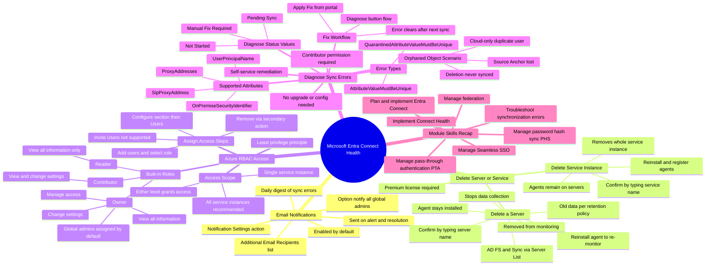

# Module 04: Plan, design, and implement Microsoft Entra Connect - Mind Map (part 2)

Source lessons

- Manage Microsoft Entra Health
- Summary and resources

```mermaid
mindmap
  root((Microsoft Entra Connect Health))
    Email Notifications
      Enabled by default
      Sent on alert and resolution
      Notification Settings action
      Additional Email Recipients list
      Option notify all global admins
      Daily digest of sync errors
    Delete Server or Service
      Premium license required
      Delete a Server
        AD FS and Sync via Server List
        Stops data collection
        Removed from monitoring
        Agent stays installed
        Old data per retention policy
        Reinstall agent to re-monitor
        Confirm by typing server name
      Delete Service Instance
        Removes whole service instance
        Agents remain on servers
        Reinstall and register agents
        Confirm by typing service name
    Azure RBAC Access
      Least privilege principle
      Built-in Roles
        Owner
          Manage access
          View all information
          Change settings
          Global admins assigned by default
        Contributor
          View and change settings
        Reader
          View all information only
      Access Scope
        All service instances recommended
        Single service instance
        Either level grants access
      Assign Access Steps
        Configure section then Users
        Add users and select role
        Invite Users not supported
        Remove via secondary action
    Diagnose Sync Errors
      Self-service remediation
      No upgrade or config needed
      Contributor permission required
      Supported Attributes
        UserPrincipalName
        ProxyAddresses
        SipProxyAddress
        OnPremiseSecurityIdentifier
      Error Types
        AttributeValueMustBeUnique
        QuarantinedAttributeValueMustBeUnique
      Orphaned Object Scenario
        Source Anchor lost
        Deletion never synced
        Cloud-only duplicate user
      Diagnose Status Values
        Not Started
        Manual Fix Required
        Pending Sync
      Fix Workflow
        Diagnose button flow
        Apply Fix from portal
        Error clears after next sync
    Module Skills Recap
      Plan and implement Entra Connect
      Manage password hash sync PHS
      Manage pass-through authentication PTA
      Manage Seamless SSO
      Manage federation
      Troubleshoot synchronization errors
      Implement Connect Health
```
